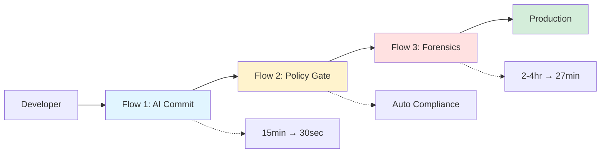
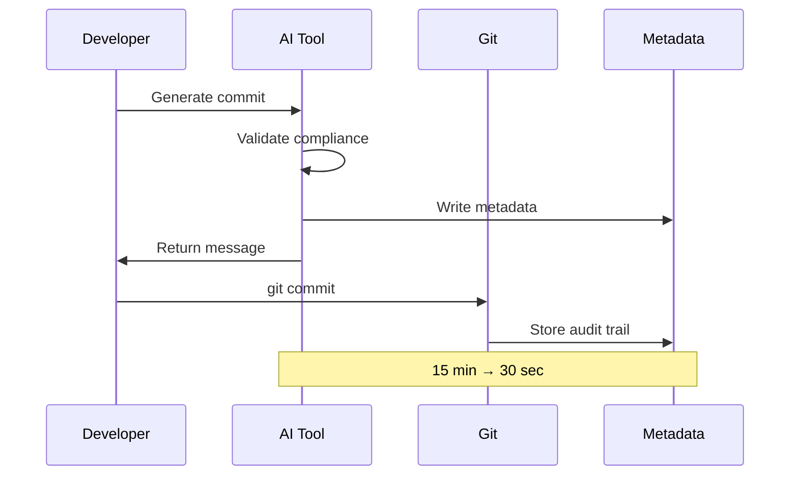
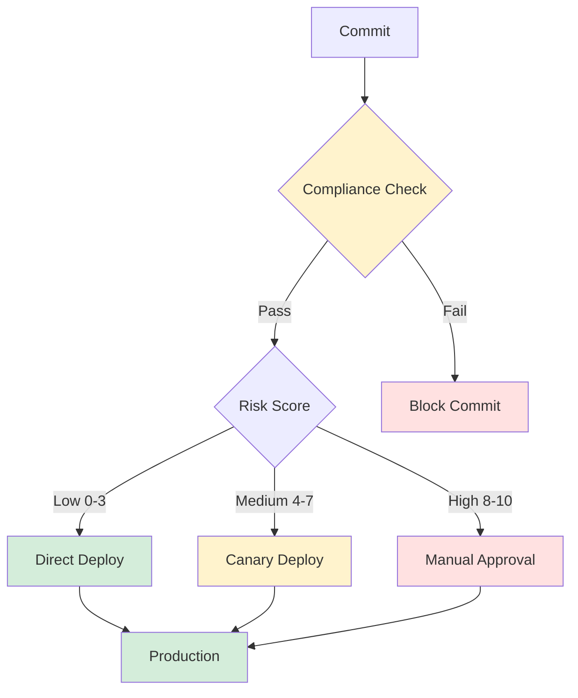
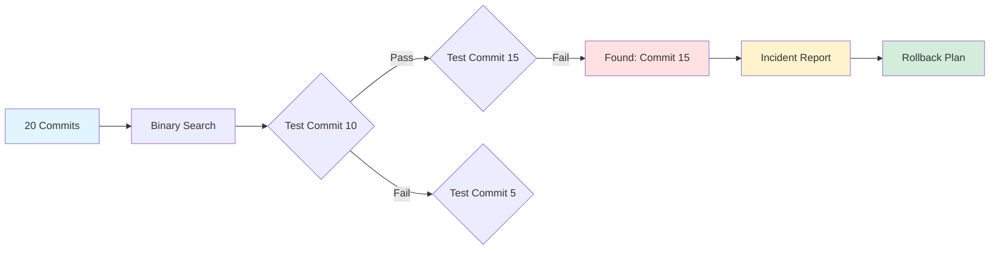
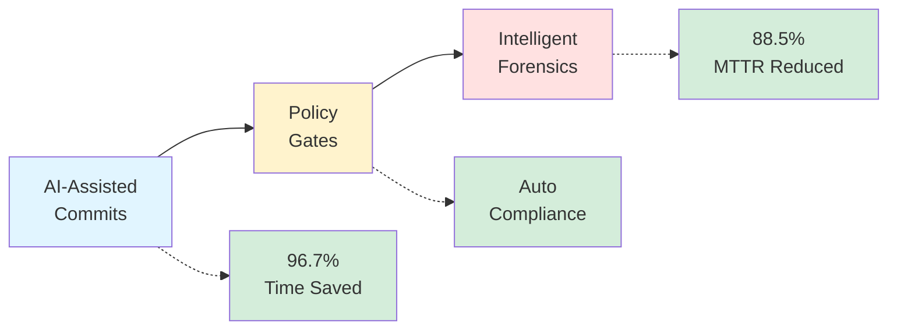

# START HERE: 30-Minute Walkthrough

Welcome! This guide walks you through **three flagship flows** in 30-60 minutes.

**Prerequisites**: Python 3.10+, Go 1.22+, Git, OPA CLI

---

## System Overview



---

## Quick Setup (5 minutes)

```bash
# 1. Verify prerequisites
python3 --version  # Should be 3.10+
go version         # Should be 1.22+
git --version      # Should be 2.30+
opa version        # Install: brew install opa

# 2. Install Python tools
pip install -e tools/

# 3. Verify installation
gitops-health --version
# Expected: gitops-health version 2.0.0

# 4. Run validation
./scripts/validate-setup.sh
```

---

## The Three Flagship Flows

### Flow 1: AI-Assisted Healthcare Commit (10 min)



**What**: Generate compliant commit messages with AI assistance  
**Why**: Saves 15 minutes per commit, ensures required metadata

```bash
# Scenario: Add encryption to PHI service
cd services/phi-service

# 1. Make a code change (example)
cat >> internal/handlers/patient.go << 'EOF'

// EncryptPatientData encrypts patient data before storage
// Compliance: HIPAA Security Rule §164.312(a)(2)(iv)
func EncryptPatientData(data []byte) ([]byte, error) {
    // TODO: Implement AES-256-GCM encryption
    return data, nil
}
EOF

git add internal/handlers/patient.go

# 2. Generate compliant commit with AI
cd ../..
./tools/healthcare_commit_generator.py \
  --type security \
  --scope phi \
  --description "add AES-256 encryption for patient records" \
  --interactive

# This generates:
# - Compliant commit message with HIPAA metadata
# - Machine-readable JSON: .gitops/commit_metadata.json
# - Suggested reviewers
# - Risk level assessment

# 3. Review and commit
git commit -F .gitops/commit_message.txt

# 4. Verify metadata
cat .gitops/commit_metadata.json | jq '.'
```

**✅ You've created a compliant healthcare commit in 30 seconds!**

---

### Flow 2: Policy + Risk Gate (10 min)



**What**: Automated compliance checking and risk-adaptive deployment  
**Why**: Blocks non-compliant commits, adapts deployment strategy to risk

```bash
# 1. Run compliance check
./tools/ai_compliance_framework.py check --commit HEAD

# Output:
# ✓ HIPAA metadata present
# ✓ PHI-Impact level specified
# ✓ Clinical-Safety documented
# Status: COMPLIANT

# 2. Run risk scoring
./tools/git_intel/risk_scorer.py score --commit HEAD

# Output:
# Risk Score: 6.5 (MEDIUM)
# Deployment Strategy: CANARY
# - 10% → 50% → 100%
# - Monitor for 24h
# - Auto-rollback if errors > 0.1%

# 3. Test policy enforcement (negative case)
echo "// test" >> services/phi-service/internal/handlers/patient.go
git add services/phi-service/
git commit -m "fix(phi): update handler"

# Will FAIL with:
# ❌ PHI-related changes require HIPAA metadata
# ❌ Missing PHI-Impact level
# ❌ Missing Clinical-Safety assessment

# Clean up
git reset HEAD~1
git checkout services/phi-service/internal/handlers/patient.go

# 4. See CI/CD decision tree
./scripts/simulate-ci-pipeline.sh HEAD
```

**✅ Policies enforce compliance, risk gates deployment!**

---

### Flow 3: Intelligent Forensics (10 min)



**What**: AI-powered bisect finds performance regressions automatically  
**Why**: Reduces MTTR from 2-4 hours to 27 minutes

```bash
# 1. Simulate a performance regression
./scripts/simulate-regression.sh

# Creates 20 commits with latency metrics
# Introduces regression at commit-15 (150ms → 450ms)

# 2. Run intelligent bisect
./tools/intelligent_bisect.py \
  --metric latency \
  --threshold 200 \
  --start commit-01 \
  --end commit-20

# Output:
# Bisecting 20 commits...
# Step 1/5: Testing commit-10 → 125ms ✓
# Step 2/5: Testing commit-15 → 450ms ✗
# Step 3/5: Testing commit-12 → 135ms ✓
# ...
# Regression found: commit-15
# Completed in 5 steps (2m 43s)

# 3. Generate incident report
./tools/intelligent_bisect.py analyze --commit commit-15

# Generates: reports/incident-<timestamp>.json
# Contains:
# - Root cause analysis
# - Performance impact
# - Compliance metadata
# - Rollback recommendation

# 4. View report
cat reports/incident-*.json | jq '.'

# 5. Clean up
./scripts/cleanup-regression-sim.sh
```

**✅ Found regression in 5 steps, generated incident report!**

---

## What You've Learned



You've experienced all three flagship flows:

1. **✅ AI-Assisted Commits**: 15 min → 30 sec (96.7% time savings)
2. **✅ Policy + Risk Gates**: Automatic compliance enforcement
3. **✅ Intelligent Forensics**: 2-4 hours → 27 min MTTR (88.5% savings)

---

## Next Steps

### Explore the Code
- **Tools**: `tools/` - See how each tool works
- **Policies**: `policies/` - Understand OPA rules
- **Services**: `services/phi-service/` - Healthcare patterns

### Read Documentation
- [docs/README.md](docs/README.md) - System architecture
- [DEPLOYMENT.md](DEPLOYMENT.md) - Production deployment
- [COMPLIANCE.md](COMPLIANCE.md) - HIPAA/FDA/SOX frameworks
- [CONTRIBUTING.md](CONTRIBUTING.md) - Development workflow

### Run Tests
```bash
pytest tests/python/ -v        # Python tests
go test ./services/... -v      # Go tests
./tests/e2e/run-all-flows.sh   # E2E tests
```

### Customize for Your Org
1. Replace demo services with your healthcare apps
2. Customize OPA policies for your requirements
3. Integrate into your CI/CD pipelines
4. Add your org's specific metadata fields

---

## Troubleshooting

**`gitops-health: command not found`**
```bash
pip install --force-reinstall -e tools/
```

**OPA policies fail**
```bash
opa test policies/ --verbose
opa check policies/
```

**Services don't build**
```bash
cd services/phi-service
go mod tidy
go build ./cmd/phi-service
```

---

## Getting Help

- **Docs**: [docs/](docs/) folder
- **Issues**: [GitHub Issues](https://github.com/Oluseyi-Kofoworola/gitops2-healthcare-intelligence-git-commit/issues)
- **Examples**: [docs/END_TO_END_SCENARIO.md](docs/END_TO_END_SCENARIO.md)

---

**Time**: 30-60 minutes  
**Status**: Reference Implementation  
**Version**: 2.0

*You've completed the walkthrough! Now you understand how AI + Git + Policy work together for healthcare compliance.*
