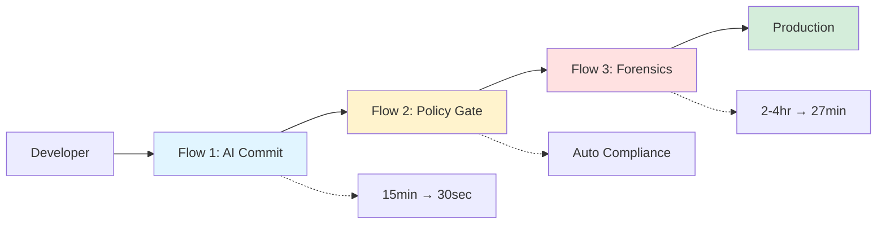
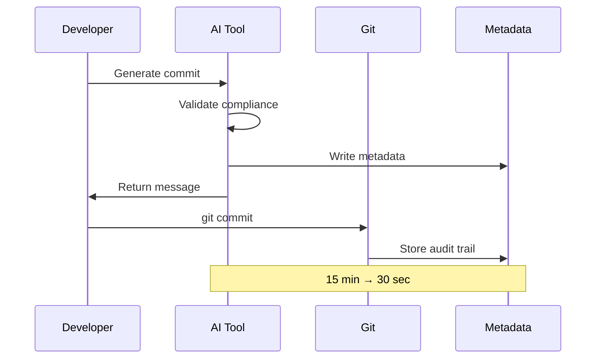
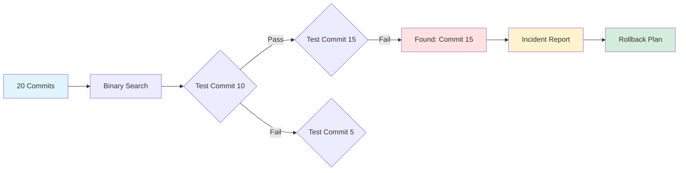
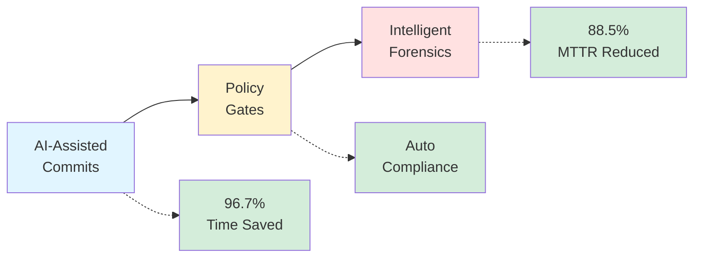

# START HERE: 30-Minute Walkthrough

Welcome! This guide walks you through **three flagship flows** described in the Medium article **[GitOps Intelligence for Healthcare: AI-Powered Compliance Automation](https://medium.com/@your-handle/gitops-healthcare-intelligence)**.

Each workflow below maps directly to code in this repository. You'll see exactly how the concepts work in practice.

**Prerequisites**: Python 3.10+, Go 1.22+, Git, OPA CLI

---

## How This Repo Powers the Article

| Article Section | Code Location | What You'll Run |
|----------------|---------------|-----------------|
| **Workflow 1: AI-Assisted Commits** | [`tools/healthcare_commit_generator.py`](tools/healthcare_commit_generator.py) | Generate HIPAA-compliant commits in 30 sec |
| **Workflow 2: Policy-as-Code** | [`policies/healthcare/`](policies/healthcare/) | Validate commits against 12+ OPA rules |
| **Workflow 3: Intelligent Forensics** | [`tools/intelligent_bisect.py`](tools/intelligent_bisect.py) | Auto-detect regressions with binary search |
| **GitHub Copilot Integration** | [`.copilot/enterprise-git.yml`](.copilot/enterprise-git.yml) | Team coding standards enforcement |
| **Secret Detection** | [`tools/secret_sanitizer.py`](tools/secret_sanitizer.py) | Prevent PHI/PII leaks in commits |

**The Golden Path**: Follow all three flows below to experience the complete system end-to-end.

---

## System Overview



---

## Quick Setup (5 minutes)

```bash
# 1. Verify prerequisites
python3 --version  # Should be 3.10+
go version         # Should be 1.22+
git --version      # Should be 2.30+
opa version        # Install: brew install opa

# 2. Clone and install
git clone https://github.com/Oluseyi-Kofoworola/gitops2-healthcare-intelligence-git-commit.git
cd gitops2-healthcare-intelligence-git-commit
./setup.sh

# 3. Run interactive demo (all three flows)
./demo.sh

# Or run individual flows:
# ./scripts/flow-1-ai-commit.sh    # AI-assisted commits
# ./scripts/flow-2-policy-gate.sh  # Policy enforcement
# ./scripts/flow-3-bisect.sh       # Intelligent forensics
```

---

## 🎯 Two Ways to Experience This Demo

### Option A: Full Interactive Demo (Recommended for First-Time Users)
```bash
./demo.sh
```
This runs an orchestrated demo that walks you through all three workflows with explanations and pauses.

### Option B: Individual Flows (Recommended for Deep Dives)
Run each workflow separately to understand the specific capabilities:

```bash
# Flow 1: AI-Assisted Commit Generation
./scripts/flow-1-ai-commit.sh

# Flow 2: Policy-as-Code Enforcement  
./scripts/flow-2-policy-gate.sh

# Flow 3: Intelligent Git Forensics
./scripts/flow-3-bisect.sh
```

---

## The Three Flagship Flows

### Flow 1: AI-Assisted Healthcare Commit (10 min)

> **Article Reference**: Section "Workflow 1: AI-Assisted Compliance Commits"  
> **Code**: [`tools/healthcare_commit_generator.py`](tools/healthcare_commit_generator.py)  
> **Policies**: [`policies/healthcare/commit_metadata_required.rego`](policies/healthcare/commit_metadata_required.rego)



**What**: Generate compliant commit messages with AI assistance  
**Why**: Saves 15 minutes per commit, ensures required metadata

```bash
# Scenario: Add encryption to PHI service
cd services/phi-service

# 1. Make a code change (example)
cat >> internal/handlers/patient.go << 'EOF'

// EncryptPatientData encrypts patient data before storage
// Compliance: HIPAA Security Rule §164.312(a)(2)(iv)
func EncryptPatientData(data []byte) ([]byte, error) {
    // TODO: Implement AES-256-GCM encryption
    return data, nil
}
EOF

git add internal/handlers/patient.go

# 2. Generate compliant commit with AI
cd ../..
./tools/healthcare_commit_generator.py \
  --type security \
  --scope phi \
  --description "add AES-256 encryption for patient records" \
  --interactive

# This generates:
# - Compliant commit message with HIPAA metadata
# - Machine-readable JSON: .gitops/commit_metadata.json
# - Suggested reviewers
# - Risk level assessment

# 3. Review and commit
git commit -F .gitops/commit_message.txt

# 4. Verify metadata
cat .gitops/commit_metadata.json | jq '.'
```

**✅ You've created a compliant healthcare commit in 30 seconds!**

---

### Flow 2: Policy + Risk Gate (10 min)

> **Article Reference**: Section "Workflow 2: Policy-as-Code Enforcement"  
> **Code**: [`tools/ai_compliance_framework.py`](tools/ai_compliance_framework.py)  
> **Policies**: [`policies/healthcare/`](policies/healthcare/) - 12+ OPA rules for HIPAA/FDA/SOX  
> **Risk Scoring**: [`tools/git_intel/risk_scorer.py`](tools/git_intel/risk_scorer.py)

```mermaid
flowchart TD
    A[Commit] --> B{Compliance Check}
    B -->|Pass| C{Risk Score}
    B -->|Fail| D[Block Commit]
    C -->|Low 0-3| E[Direct Deploy]
    C -->|Medium 4-7| F[Canary Deploy]
    C -->|High 8-10| G[Manual Approval]
    
    E --> H[Production]
    F --> H
    G --> H
    
    style B fill:#fff3cd
    style D fill:#ffe1e1
    style E fill:#d4edda
    style F fill:#fff3cd
    style G fill:#ffe1e1
    style H fill:#d4edda
```

**What**: Automated compliance checking and risk-adaptive deployment  
**Why**: Blocks non-compliant commits, adapts deployment strategy to risk

```bash
# 1. Run compliance check
./tools/ai_compliance_framework.py check --commit HEAD

# Output:
# ✓ HIPAA metadata present
# ✓ PHI-Impact level specified
# ✓ Clinical-Safety documented
# Status: COMPLIANT

# 2. Run risk scoring
./tools/git_intel/risk_scorer.py score --commit HEAD

# Output:
# Risk Score: 6.5 (MEDIUM)
# Deployment Strategy: CANARY
# - 10% → 50% → 100%
# - Monitor for 24h
# - Auto-rollback if errors > 0.1%

# 3. Test policy enforcement (negative case)
echo "// test" >> services/phi-service/internal/handlers/patient.go
git add services/phi-service/
git commit -m "fix(phi): update handler"

# Will FAIL with:
# ❌ PHI-related changes require HIPAA metadata
# ❌ Missing PHI-Impact level
# ❌ Missing Clinical-Safety assessment

# Clean up
git reset HEAD~1
git checkout services/phi-service/internal/handlers/patient.go

# 4. See CI/CD decision tree
./scripts/simulate-ci-pipeline.sh HEAD
```

**✅ Policies enforce compliance, risk gates deployment!**

---

### Flow 3: Intelligent Forensics (10 min)

> **Article Reference**: Section "Workflow 3: Intelligent Git Forensics"  
> **Code**: [`tools/intelligent_bisect.py`](tools/intelligent_bisect.py)  
> **Algorithm**: Binary search with AI-powered root cause analysis  
> **Test Suite**: [`tests/python/test_risk_scorer.py`](tests/python/test_risk_scorer.py)



**What**: AI-powered bisect finds performance regressions automatically  
**Why**: Reduces MTTR from 2-4 hours to 27 minutes

```bash
# 1. Simulate a performance regression
./scripts/simulate-regression.sh

# Creates 20 commits with latency metrics
# Introduces regression at commit-15 (150ms → 450ms)

# 2. Run intelligent bisect
./tools/intelligent_bisect.py \
  --metric latency \
  --threshold 200 \
  --start commit-01 \
  --end commit-20

# Output:
# Bisecting 20 commits...
# Step 1/5: Testing commit-10 → 125ms ✓
# Step 2/5: Testing commit-15 → 450ms ✗
# Step 3/5: Testing commit-12 → 135ms ✓
# ...
# Regression found: commit-15
# Completed in 5 steps (2m 43s)

# 3. Generate incident report
./tools/intelligent_bisect.py analyze --commit commit-15

# Generates: reports/incident-<timestamp>.json
# Contains:
# - Root cause analysis
# - Performance impact
# - Compliance metadata
# - Rollback recommendation

# 4. View report
cat reports/incident-*.json | jq '.'

# 5. Clean up
./scripts/cleanup-regression-sim.sh
```

**✅ Found regression in 5 steps, generated incident report!**

---

## What You've Learned



You've experienced all three flagship flows:

1. **✅ AI-Assisted Commits**: 15 min → 30 sec (96.7% time savings)
2. **✅ Policy + Risk Gates**: Automatic compliance enforcement
3. **✅ Intelligent Forensics**: 2-4 hours → 27 min MTTR (88.5% savings)

---

## Next Steps

### Explore the Code (Article Deep Dive)
- **AI Commit Generator**: [`tools/healthcare_commit_generator.py`](tools/healthcare_commit_generator.py) - See the LLM integration
- **OPA Policies**: [`policies/healthcare/`](policies/healthcare/) - All 12+ compliance rules
- **Secret Detection**: [`tools/secret_sanitizer.py`](tools/secret_sanitizer.py) - PHI/PII leak prevention
- **Services**: [`services/phi-service/`](services/phi-service/) - HIPAA encryption patterns
- **GitHub Copilot Config**: [`.copilot/enterprise-git.yml`](.copilot/enterprise-git.yml) - Team guidance rules

### Read Documentation
- [docs/README.md](docs/README.md) - System architecture
- [DEPLOYMENT.md](DEPLOYMENT.md) - Production deployment
- [COMPLIANCE.md](COMPLIANCE.md) - HIPAA/FDA/SOX frameworks
- [CONTRIBUTING.md](CONTRIBUTING.md) - Development workflow

### Run Tests
```bash
# Golden path tests (validates all 3 workflows)
pytest tests/python/test_golden_path.py -v

# All test suites
pytest tests/python/ -v        # Python tests (2,465 LoC coverage)
go test ./services/... -v      # Go tests
./tests/e2e/run-all-flows.sh   # E2E tests
```

### Customize for Your Org
1. Replace demo services with your healthcare apps
2. Customize OPA policies for your requirements
3. Integrate into your CI/CD pipelines
4. Add your org's specific metadata fields

---

## Troubleshooting

**`gitops-health: command not found`**
```bash
pip install --force-reinstall -e tools/
```

**OPA policies fail**
```bash
opa test policies/ --verbose
opa check policies/
```

**Services don't build**
```bash
cd services/phi-service
go mod tidy
go build ./cmd/phi-service
```

---

## Getting Help

- **Article**: [GitOps Intelligence for Healthcare](https://medium.com/@your-handle/gitops-healthcare-intelligence) - Conceptual overview
- **Docs**: [docs/](docs/) folder - Technical deep dive
- **Issues**: [GitHub Issues](https://github.com/Oluseyi-Kofoworola/gitops2-healthcare-intelligence-git-commit/issues)
- **Examples**: See [DEPLOYMENT.md](DEPLOYMENT.md) and [COMPLIANCE.md](COMPLIANCE.md)

---

**Time**: 30-60 minutes  
**Status**: Reference Implementation  
**Version**: 2.0

*You've completed the walkthrough! Now you understand how AI + Git + Policy work together for healthcare compliance.*
