# START HERE: 30-Minute Walkthrough

Welcome! This guide walks you through **three flagship flows** described in the Medium article **[GitOps Intelligence for Healthcare: AI-Powered Compliance Automation](https://medium.com/@your-handle/gitops-healthcare-intelligence)**.

Each workflow below maps directly to code in this repository. You'll see exactly how the concepts work in practice.

**Prerequisites**: Python 3.10+, Go 1.22+, Git, OPA CLI

---

## How This Repo Powers the Article

| Article Section | Code Location | What You'll Run |
|----------------|---------------|-----------------|
| **Workflow 1: AI-Assisted Commits** | [`tools/healthcare_commit_generator.py`](tools/healthcare_commit_generator.py) | Generate HIPAA-compliant commits in 30 sec |
| **Workflow 2: Policy-as-Code** | [`policies/healthcare/`](policies/healthcare/) | Validate commits against 12+ OPA rules |
| **Workflow 3: Intelligent Forensics** | [`tools/intelligent_bisect.py`](tools/intelligent_bisect.py) | Auto-detect regressions with binary search |
| **GitHub Copilot Integration** | [`.copilot/enterprise-git.yml`](.copilot/enterprise-git.yml) | Team coding standards enforcement |
| **Secret Detection** | [`tools/secret_sanitizer.py`](tools/secret_sanitizer.py) | Prevent PHI/PII leaks in commits |

**The Golden Path**: Follow all three flows below to experience the complete system end-to-end.

---

## System Overview

```mermaid
flowchart LR
    A[Developer] --> B[Flow 1: AI Commit]
    B --> C[Flow 2: Policy Gate]
    C --> D[Flow 3: Forensics]
    D --> E[Production]
    
    B -.-> F[15min → 30sec]
    C -.-> G[Auto Compliance]
    D -.-> H[2-4hr → 27min]
    
    style B fill:#e1f5ff
    style C fill:#fff3cd
    style D fill:#ffe1e1
    style E fill:#d4edda
```



---

## Quick Setup (5 minutes)

```bash
# 1. Verify prerequisites
python3 --version  # Should be 3.10+
go version         # Should be 1.22+
git --version      # Should be 2.30+
opa version        # Install: brew install opa

# 2. Clone and install
git clone https://github.com/Oluseyi-Kofoworola/gitops2-healthcare-intelligence-git-commit.git
cd gitops2-healthcare-intelligence-git-commit
./setup.sh

# 3. Run interactive demo (all three flows)
./demo.sh

# Or run individual flows:
# ./scripts/flow-1-ai-commit.sh    # AI-assisted commits
# ./scripts/flow-2-policy-gate.sh  # Policy enforcement
# ./scripts/flow-3-bisect.sh       # Intelligent forensics
```

---

## 🎯 Live Production Demo (No Simulation)

**This is a fully functional demonstration using real code, real tests, and real policies.**

### What's Actually Happening:
- ✅ **Real Code Changes**: Modifies actual Go services with working encryption
- ✅ **Real Tests**: Runs Go test suite with measurable performance metrics
- ✅ **Real Policies**: OPA validates against actual compliance rules
- ✅ **Real Git Operations**: Creates commits, branches, and history
- ✅ **Real Metrics**: Measures actual latency, test coverage, and risk scores

### Quick Start
```bash
# Run complete live demo (creates real commits, runs real tests)
./demo.sh

# Or run individual flows:
./scripts/flow-1-ai-commit.sh    # Generates real compliant commit
./scripts/flow-2-policy-gate.sh  # Validates with OPA policies
./scripts/flow-3-bisect.sh       # Finds real performance regression
```

**Note**: This creates actual Git commits. Run `./scripts/cleanup-demo.sh` to reset.

---

## The Three Flagship Flows

### Flow 1: AI-Assisted Healthcare Commit (10 min)

> **Article Reference**: Section "Workflow 1: AI-Assisted Compliance Commits"  
> **Code**: [`tools/healthcare_commit_generator.py`](tools/healthcare_commit_generator.py)  
> **Policies**: [`policies/healthcare/commit_metadata_required.rego`](policies/healthcare/commit_metadata_required.rego)

**LIVE DEMO**: This creates **real code** and **real commits** on your system.


**What Happens**: Creates actual Go encryption service with AES-256-GCM implementation  
**Why Real**: Demonstrates compliance metadata generation on real code changes

```bash
# Run Flow 1: Creates real encryption.go file
./scripts/flow-1-ai-commit.sh

# What it does:
# 1. Creates services/phi-service/internal/handlers/encryption.go
# 2. Implements working AES-256-GCM encryption functions
# 3. Generates .gitops/commit_message.txt with HIPAA metadata
# 4. Creates .gitops/commit_metadata.json with compliance data
# 5. Stages files for commit (doesn't commit automatically)

# Review what was created:
cat services/phi-service/internal/handlers/encryption.go  # Real encryption code
cat .gitops/commit_metadata.json | jq '.'                # Real metadata

# Commit if you want:
git commit -F .gitops/commit_message.txt
```

**✅ Result**: Real encryption code + compliant commit message in 30 seconds!

---

### Flow 2: Policy + Risk Gate (10 min)

> **Article Reference**: Section "Workflow 2: Policy-as-Code Enforcement"  
> **Code**: [`tools/ai_compliance_framework.py`](tools/ai_compliance_framework.py)  
> **Policies**: [`policies/healthcare/`](policies/healthcare/) - 12+ OPA rules for HIPAA/FDA/SOX  
> **Risk Scoring**: [`tools/git_intel/risk_scorer.py`](tools/git_intel/risk_scorer.py)

**LIVE DEMO**: Validates against **real OPA policies** with **actual policy decisions**.


**What Happens**: Validates real commits with OPA, calculates actual risk scores  
**Why Real**: Shows policy-as-code enforcement with measurable outputs

```bash
# Run Flow 2: Tests real OPA policies
./scripts/flow-2-policy-gate-real.sh

# What it does:
# 1. Creates compliant commit with full HIPAA metadata
# 2. Validates with actual OPA policies (opa eval)
# 3. Tests both PASS and FAIL scenarios
# 4. Calculates real risk score (0-10 scale)
# 5. Outputs deployment strategy (DIRECT/CANARY/MANUAL)

# Example Output:
# ✓ HIPAA metadata present
# ✓ PHI impact level specified
# ✓ Clinical safety documented
# Risk Score: 6.5/10 (MEDIUM)
# Deployment: CANARY (10% → 50% → 100%)
```

**✅ Result**: Real policy validation + calculated deployment strategy!

---

### Flow 3: Intelligent Forensics (10 min)

> **Article Reference**: Section "Workflow 3: Intelligent Git Forensics"  
> **Code**: [`tools/intelligent_bisect.py`](tools/intelligent_bisect.py)  
> **Algorithm**: Binary search with real Go test execution  
> **Test Suite**: Real Go benchmarks in [`services/phi-service/internal/handlers/patient_test.go`](services/phi-service/internal/handlers/patient_test.go)

**LIVE DEMO**: Creates **20 real commits**, injects **real regression**, finds it with **actual binary search**.


**What Happens**: Creates demo branch with 20 commits, finds regression with git bisect + real tests  
**Why Real**: Proves binary search works on actual code with measurable performance

```bash
# Run Flow 3: Real binary search with Go tests
./scripts/flow-3-bisect-real.sh

# What it does:
# 1. Creates demo branch (doesn't touch your main code)
# 2. Creates patient_test.go with real Go benchmark
# 3. Makes 19 commits with 50ms latency (good performance)
# 4. Makes 1 commit with 250ms latency (regression!)
# 5. Runs git bisect with actual Go tests
# 6. Finds bad commit in ~5 steps (log₂(20) ≈ 4.3)
# 7. Generates JSON incident report

# Example Output:
# Step 1: Testing commit abc123... ✅ (55ms)
# Step 2: Testing commit def456... ❌ (267ms)
# Step 3: Testing commit ghi789... ✅ (51ms)
# Step 4: Testing commit jkl012... ❌ (258ms)
# Step 5: Testing commit mno345... ✅ (49ms)
# 
# Regression found: commit def456
# Time: 2m 43s (vs manual: 2-4 hours)

# View the real incident report:
cat reports/incident-*.json | jq '.'
```

**✅ Result**: Real regression found in O(log n) steps with actual Go tests!

---

## What You've Learned


You've experienced all three flagship flows:

1. **✅ AI-Assisted Commits**: 15 min → 30 sec (96.7% time savings)
2. **✅ Policy + Risk Gates**: Automatic compliance enforcement
3. **✅ Intelligent Forensics**: 2-4 hours → 27 min MTTR (88.5% savings)

---

## Next Steps

### Explore the Code (Article Deep Dive)
- **AI Commit Generator**: [`tools/healthcare_commit_generator.py`](tools/healthcare_commit_generator.py) - See the LLM integration
- **OPA Policies**: [`policies/healthcare/`](policies/healthcare/) - All 12+ compliance rules
- **Secret Detection**: [`tools/secret_sanitizer.py`](tools/secret_sanitizer.py) - PHI/PII leak prevention
- **Services**: [`services/phi-service/`](services/phi-service/) - HIPAA encryption patterns
- **GitHub Copilot Config**: [`.copilot/enterprise-git.yml`](.copilot/enterprise-git.yml) - Team guidance rules

### Read Documentation
- [docs/README.md](docs/README.md) - System architecture
- [DEPLOYMENT.md](DEPLOYMENT.md) - Production deployment
- [COMPLIANCE.md](COMPLIANCE.md) - HIPAA/FDA/SOX frameworks
- [CONTRIBUTING.md](CONTRIBUTING.md) - Development workflow

### Run Tests
```bash
# Golden path tests (validates all 3 workflows)
pytest tests/python/test_golden_path.py -v

# All test suites
pytest tests/python/ -v        # Python tests (2,465 LoC coverage)
go test ./services/... -v      # Go tests
./tests/e2e/run-all-flows.sh   # E2E tests
```

### Customize for Your Org
1. Replace demo services with your healthcare apps
2. Customize OPA policies for your requirements
3. Integrate into your CI/CD pipelines
4. Add your org's specific metadata fields

---

## Troubleshooting

**`gitops-health: command not found`**
```bash
pip install --force-reinstall -e tools/
```

**OPA policies fail**
```bash
opa test policies/ --verbose
opa check policies/
```

**Services don't build**
```bash
cd services/phi-service
go mod tidy
go build ./cmd/phi-service
```

---

## Getting Help

- **Article**: [GitOps Intelligence for Healthcare](https://medium.com/@your-handle/gitops-healthcare-intelligence) - Conceptual overview
- **Docs**: [docs/](docs/) folder - Technical deep dive
- **Issues**: [GitHub Issues](https://github.com/Oluseyi-Kofoworola/gitops2-healthcare-intelligence-git-commit/issues)
- **Examples**: See [DEPLOYMENT.md](DEPLOYMENT.md) and [COMPLIANCE.md](COMPLIANCE.md)

---

**Time**: 30-60 minutes  
**Status**: Reference Implementation  
**Version**: 2.0

*You've completed the walkthrough! Now you understand how AI + Git + Policy work together for healthcare compliance.*
