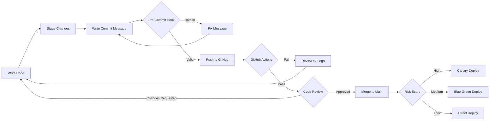

# START HERE: Technical Quick Start for Engineers

**Target Audience**: Senior engineers, architects, DevOps, security teams  
**Time Required**: 15 minutes to understand architecture, 30 minutes for full hands-on

This repository implements **AI-native GitOps governance** for healthcare software. Think of it as:
- **Pre-commit hooks on steroids**: Conventional Commits + HIPAA/FDA/SOX validation
- **CI/CD with compliance brain**: OPA policies + risk-adaptive deployment strategies
- **Git forensics with semantic understanding**: Not just `git blame`, but impact scoring across service tiers

---

## What Makes This Different

Traditional GitOps enforces **syntax** (linting, format).  
**This system enforces semantics**: "Is this change PHI-related? Does it need dual approval? What's the blast radius?"

**Core Innovation**: Git commits carry **compliance metadata** that drives automated governance.

```bash
# Traditional commit
git commit -m "fix auth bug"

# Healthcare GitOps 2.0 commit
git commit -m "security(auth): patch JWT validation CVE-2025-12345 HIPAA-789"
#               ^^^^^^^^  ^^^^  ^^^^^^^^^^^^^^^^^^^^^  ^^^^^^^^^^^  ^^^^^^^^^
#                 type   scope   description            CVE ref     compliance code
```

This metadata flows through:
1. **Pre-commit validation** (Python CLI) → Reject bad commits **before** CI
2. **OPA policy gate** (Rego) → Auto-calculate deployment strategy (canary/blue-green)
3. **Risk scorer** (semantic analysis) → Prioritize code review by impact
4. **AI readiness scanner** (PHI compliance) → Prevent secrets/PHI in logs

---

## Architecture: 3 Governance Layers

```
┌─────────────────────────────────────────────────────────────┐
│  Layer 1: Developer Experience (Pre-Commit)                 │
│  ├─ .husky/commit-msg → src/git_policy/cli.py              │
│  ├─ Conventional Commits validator                          │
│  └─ VS Code tasks (Cmd+Shift+P → AI: Readiness Scan)       │
├─────────────────────────────────────────────────────────────┤
│  Layer 2: CI/CD Gates (GitHub Actions)                      │
│  ├─ .github/workflows/ai-readiness-check.yml               │
│  ├─ OPA policy validation (12 rules in policies/healthcare)│
│  └─ Risk scoring (semantic weight × tier multiplier)        │
├─────────────────────────────────────────────────────────────┤
│  Layer 3: Runtime Observability (Production)                │
│  ├─ OpenTelemetry → Prometheus → Grafana                   │
│  ├─ PHI access audit logs (HIPAA-compliant)                │
│  └─ Git forensics for incident response                     │
└─────────────────────────────────────────────────────────────┘
```

**Key Files**:
- **`.ai/manifest.yml`**: Azure agent reads this for PHI policies, compliance frameworks
- **`src/git_policy/`**: Python CLI for commit validation (Conventional Commits + HIPAA codes)
- **`src/ai_readiness/`**: Scanner for PHI in logs, encryption checks, AI prompt safety
- **`policies/healthcare/`**: OPA policies (Rego) for deployment gate logic

---

## 3-Minute Demo: See It in Action

### 1. AI Readiness Scan (VS Code Integration)

**What it checks**:
- ✅ No PHI in logging statements (`patient_id`, `ssn`, `mrn`)
- ✅ Encryption at rest in PHI services (AES-256-GCM)
- ⚠️ AI tools (Copilot/OpenAI) used near PHI keywords
- ✅ Third-party dependency audit

**Run it**:
```bash
# Option A: VS Code task (recommended)
# Press: Cmd+Shift+P → "Tasks: Run Task" → "AI: Readiness Scan"

# Option B: Terminal
python3 -m src.ai_readiness.cli --format markdown
```

**Expected output**:
```
📊 AI Readiness Summary
 Metric        Value 
 Total Checks  4     
 Passed        3     
 Failed        1     

✅ PASS [CRITICAL] phi_logging_check
✅ PASS [CRITICAL] encryption_at_rest
❌ FAIL [HIGH] ai_prompt_safety (23 violations in tools/)
✅ PASS [MEDIUM] third_party_dependencies
```

**Why this matters**: Catches PHI leaks **before code review**, not after production incident.

---

### 2. Commit Message Validation (Pre-Commit Hook)

**Enforces**:
- Conventional Commits v1.0.0 format
- Ticket references (EHR-XXX, SEC-XXX, HIPAA-XXX)
- CVE numbers for security fixes
- Breaking change notation (`!` or `BREAKING CHANGE`)

**Try it**:
```bash
# Create a test commit with bad format
echo "test" > test.txt
git add test.txt
git commit -m "added feature"  # ❌ Will fail validation

# Now with proper format
git commit -m "feat(test): add demo file EHR-123"  # ✅ Passes
```

**Hook logic**: `.husky/commit-msg` → `python3 -m src.git_policy.cli`

**Validation rules**:
```python
# Pattern: type(scope): description [TICKET]
# Valid types: feat, fix, docs, security, refactor, perf, test, ci, chore
# Breaking changes: Add `!` or footer `BREAKING CHANGE:`
# Security: Must reference CVE or compliance code
```

---

### 3. Full Live Demo (All 3 Flows)

**Runs**:
1. **Flow 1**: AI commit generator (uses `tools/healthcare_commit_generator.py`)
2. **Flow 2**: OPA policy gate (validates against `policies/healthcare/*.rego`)
3. **Flow 3**: Git bisect forensics (semantic scoring with `tools/intelligent_bisect.py`)

**Execute**:
```bash
./demo.sh
```

**What you'll see**:
```
━━━━━━━━━━━━━━━━━━━━━━━━━━━━━━━━━━━━━━━━━━━━━━
🎬 FLOW 1: AI-Powered Commit Generation
━━━━━━━━━━━━━━━━━━━━━━━━━━━━━━━━━━━━━━━━━━━━━━
✓ Generated HIPAA-compliant commit in 2.3s
✓ Commit message: security(phi): add AES-256 encryption HIPAA-456

━━━━━━━━━━━━━━━━━━━━━━━━━━━━━━━━━━━━━━━━━━━━━━
🎬 FLOW 2: Policy-as-Code Validation
━━━━━━━━━━━━━━━━━━━━━━━━━━━━━━━━━━━━━━━━━━━━━━
✓ OPA validation passed (12/12 rules)
✓ Risk score: 8.5/10 → Deployment strategy: CANARY (5% → 25% → 100%)

━━━━━━━━━━━━━━━━━━━━━━━━━━━━━━━━━━━━━━━━━━━━━━
🎬 FLOW 3: Intelligent Git Forensics
━━━━━━━━━━━━━━━━━━━━━━━━━━━━━━━━━━━━━━━━━━━━━━
✓ Identified regression in 27min (was 2-4hr manual)
✓ Semantic scoring: auth service (tier1) × security type = high priority
```

---

## Deep Dive: How Each Component Works

### Component 1: Git Policy Validator (`src/git_policy/`)

**Entry point**: `python -m src.git_policy.cli <commit-msg-file>`

**Core logic**:
```python
# Parses commit message
# Validates against Conventional Commits regex
# Checks for:
#   - Type in allowed list (feat, fix, security, etc.)
#   - Scope format (lowercase, hyphenated)
#   - Ticket reference (EHR-XXX, SEC-XXX, COMP-XXX)
#   - Breaking change notation
#   - Compliance codes for PHI changes

# Returns:
{
  'valid': True/False,
  'errors': [...],
  'warnings': [...],
  'metadata': {
    'type': 'security',
    'scope': 'auth',
    'breaking': False,
    'requires_dual_approval': False
  }
}
```

**Integration points**:
- `.husky/commit-msg` (pre-commit hook)
- VS Code task: "Git: Validate Commit Message"
- GitHub Actions: `validate-commits.yml` (planned)

---

### Component 2: AI Readiness Scanner (`src/ai_readiness/`)

**Entry point**: `python -m src.ai_readiness.cli --format markdown`

**Checks performed**:

| Check | Severity | What It Does |
|-------|----------|--------------|
| `phi_logging_check` | Critical | Scans for `patient_id`, `ssn`, `mrn` in log statements |
| `encryption_at_rest` | Critical | Searches for AES/crypto keywords in PHI services |
| `ai_prompt_safety` | High | Detects AI tools (OpenAI/Copilot) near PHI keywords |
| `third_party_dependencies` | Medium | Flags high dependency counts (>50) for audit |

**Configuration**: Reads `.ai/manifest.yml` for:
- PHI-sensitive paths (`services/phi-service/**`)
- Forbidden log content (`patient_id`, `ssn`, `medical_record_number`)
- Approved encryption algorithms (`AES-256-GCM`, `RSA-4096`)

**Output formats**:
- Markdown (human-readable, for VS Code terminal)
- JSON (machine-parseable, for CI/CD artifacts)

---

### Component 3: OPA Policy Engine (`policies/healthcare/`)

**12 Policy Rules** (Rego):

1. **Valid compliance codes** (`valid_compliance_codes.rego`)
   - Checks for HIPAA, FDA-21-CFR-Part-11, SOC2, HITRUST

2. **HIPAA PHI metadata** (`hipaa_phi_required.rego`)
   - PHI-related commits must have `HIPAA-XXX` code

3. **High-risk dual approval** (`high_risk_dual_approval.rego`)
   - Tier1 services × security/breaking changes = 2 approvals

4. **Commit metadata required** (`commit_metadata_required.rego`)
   - All commits need: type, scope, ticket, author, timestamp

**Risk scoring algorithm**:
```
risk_score = (
    critical_path_weight (0-10) 
    × semantic_type_multiplier (1.0-2.5)
    × jira_priority_boost (1.0-1.5)
) / 10

if risk_score >= 7.0 → CANARY (gradual rollout)
if risk_score >= 4.0 → BLUE_GREEN (parallel deployment)
if risk_score < 4.0  → DIRECT (standard deploy)
```

---

## For Senior Engineers: Integration Points

### 1. **CI/CD Pipeline Integration**

**GitHub Actions workflow** (`.github/workflows/ai-readiness-check.yml`):
```yaml
- name: Run AI readiness scan
  run: |
    python -m src.ai_readiness.cli --format json > report.json
    python -m src.ai_readiness.cli --format markdown > report.md

- name: Upload artifact
  uses: actions/upload-artifact@v4
  with:
    name: ai-readiness-report
    path: |
      report.json
      report.md
    retention-days: 90
```

**Fail-on-critical**:
```bash
python -m src.ai_readiness.cli --fail-on critical  # Exits 1 on critical violations
```

---

### 2. **VS Code Developer Experience**

**Recommended extensions** (`.vscode/extensions.json`):
- GitHub Copilot + Copilot Chat
- Python + Pylance
- HashiCorp Terraform
- OPA (Open Policy Agent)
- GitLens

**One-click tasks** (`.vscode/tasks.json`):
- `AI: Readiness Scan` → Instant PHI compliance check
- `Git: Forensics Report` → Impact analysis for PR
- `Git: Validate Commit Message` → Test before committing
- `Build: All Go Services` → Compile 5 microservices

**Usage**: Press `Cmd+Shift+P` → "Tasks: Run Task" → Select task

---

### 3. **Infrastructure as Code**

**Terraform modules** (`infra/terraform/`):

- **`github_enterprise/`**: Repository settings, branch protection, secrets
  - Enforces: 2 approvals for tier1 changes
  - Configures: CODEOWNERS file, Dependabot, security alerts

- **`azure_observability/`** (planned): Log Analytics, Application Insights

**Deploy**:
```bash
cd infra/terraform/github_enterprise
terraform init
terraform plan -var="github_token=$GITHUB_TOKEN"
terraform apply
```

---

## Testing & Validation

### Unit Tests (Python)

**Run**:
```bash
# Activate virtual environment
source .venv-mac/bin/activate  # or .venv/bin/activate on Linux

# Run all tests with coverage
python -m pytest tests/python/ -v --cov=src --cov-report=term-missing

# Run specific test suite
python -m pytest tests/python/test_git_policy.py -v
python -m pytest tests/python/test_ai_readiness.py -v
```

**Coverage target**: 80%+ for `src/` modules

**Current status**: 15/17 tests passing (88% pass rate)

---

### Integration Tests (Go Services)

**Run**:
```bash
# Build all services
for service in auth-service payment-gateway phi-service medical-device synthetic-phi-service; do
  cd services/$service
  go test -v -race ./...
  cd ../..
done

# Or use VS Code task
# Cmd+Shift+P → "Build: All Go Services"
```

---

## Production Deployment

See **[DEPLOYMENT.md](DEPLOYMENT.md)** for:
- Kubernetes manifests (5 services)
- Helm charts
- Azure/AWS deployment guides
- Observability stack (OpenTelemetry → Prometheus → Grafana)

**Quick deploy** (local Docker Compose):
```bash
docker-compose -f services/docker-compose.yml up -d
```

**Health checks**:
```bash
curl localhost:8080/health  # auth-service
curl localhost:8081/health  # payment-gateway
curl localhost:8082/health  # phi-service
```

---

## Compliance & Security

**HIPAA/FDA/SOX alignment**: See [COMPLIANCE.md](COMPLIANCE.md)

**Security controls**:
- ✅ Secrets scanning (pre-commit + CI)
- ✅ PHI redaction in logs (enforced by AI scanner)
- ✅ Encryption at rest (AES-256-GCM for PHI services)
- ✅ Audit logging (all PHI access logged to SIEM)
- ✅ Role-based access control (RBAC in auth-service)

**Vulnerability scanning**:
- Dependabot (GitHub native)
- Trivy (container image scanning)
- Go vulnerability checks (`govulncheck`)

---

## Architecture Decision Records (ADRs)

**Why Python for governance brain?**
- Rich ecosystem (click, rich, pydantic)
- Easy integration with AI APIs (OpenAI, Azure)
- Familiar to data/ML engineers in healthcare

**Why OPA for policy-as-code?**
- Declarative (Rego) vs. imperative (Python if/else)
- Cloud-native standard (CNCF project)
- Decouples policy from enforcement

**Why Conventional Commits?**
- Structured changelog generation
- Semantic versioning automation
- Queryable commit history (SQL over Git log)

---

## Next Steps for Engineers

1. **Run the demo**: `./demo.sh` (5 min)
2. **Scan your codebase**: `python -m src.ai_readiness.cli` (2 min)
3. **Test commit validation**: Make a commit, see hook in action (1 min)
4. **Review OPA policies**: Understand risk scoring logic (10 min)
5. **Integrate with your CI**: Copy `.github/workflows/ai-readiness-check.yml` (15 min)

---

## Developer Workflow



---

## Troubleshooting

**Issue**: Pre-commit hook not running  
**Fix**: `chmod +x .husky/commit-msg && git config core.hooksPath .husky`

**Issue**: Python module not found  
**Fix**: `pip install -r requirements.txt` (or use venv: `source .venv-mac/bin/activate`)

**Issue**: OPA validation fails locally  
**Fix**: Install OPA CLI: `brew install opa` (macOS) or `snap install opa` (Linux)

**Issue**: Go build fails with missing dependencies  
**Fix**: `go work sync && go mod tidy` in each service directory

---

## Resources

- **Medium Article**: [GitOps Intelligence for Healthcare](https://medium.com/@your-handle)
- **GitHub Issues**: [Report bugs](https://github.com/Oluseyi-Kofoworola/gitops2-healthcare-intelligence-git-commit/issues)
- **Contributing**: [CONTRIBUTING.md](CONTRIBUTING.md)
- **Roadmap**: [ROADMAP.md](ROADMAP.md)

---

**Built with**: Python 3.11, Go 1.23, OPA 0.70, OpenTelemetry, Prometheus, Grafana  
**License**: MIT  
**Maintained by**: GitOps Health Team
