# Getting Started with GitOps 2.0 Healthcare Intelligence Platform

> **⏱️ Time to Complete**: 30 minutes  
> **�� What You'll Learn**: Run AI-powered healthcare compliance workflows, validate HIPAA-compliant commits, and experience intelligent incident response  
> **🎯 Outcome**: Fully functional GitOps 2.0 demo environment with 3 production-grade microservices

---
## Important Disclaimer

**This is an educational and demonstration platform designed for learning purposes.**

- **What This Is**: A fully functional demonstration of GitOps 2.0 concepts with working code examples
- **What You Can Do**: Learn AI-assisted compliance patterns, run demos, explore architectures
- **What This Is NOT**: Production-ready software or a certified compliance solution
- **Usage**: For educational, research, and demonstration purposes only

**Before Production Use**: This platform demonstrates concepts and patterns. Any production deployment requires comprehensive security audits, legal compliance review, thorough testing, and proper certifications.

**No Warranties**: This software is provided "as is" under the MIT License without warranties of any kind.

---


## 📋 Table of Contents

- [Prerequisites](#prerequisites)
- [Architecture Overview](#architecture-overview)
- [Quick Setup](#quick-setup)
- [Core Workflows](#core-workflows)
- [API Reference](#api-reference)
- [Troubleshooting](#troubleshooting)
- [Next Steps](#next-steps)

---

## Prerequisites

### Required Tools

| Tool | Version | Purpose | Installation |
|------|---------|---------|--------------|
| **Go** | 1.24+ | Microservices runtime | [go.dev/dl](https://go.dev/dl/) |
| **Python** | 3.11+ | AI tools & scripts | [python.org](https://python.org) |
| **Git** | 2.40+ | Version control | [git-scm.com](https://git-scm.com) |
| **Docker** | 24+ | Container runtime | [docker.com](https://docker.com) |
| **OpenAI API Key** | - | AI commit generation | [platform.openai.com](https://platform.openai.com) |

### System Requirements

- **CPU**: 4+ cores recommended
- **RAM**: 8GB minimum, 16GB recommended
- **Disk**: 2GB free space
- **OS**: Linux, macOS, or WSL2 on Windows

### Verify Installation

```bash
# Check all prerequisites
go version      # Should show 1.24 or higher
python3 --version  # Should show 3.11 or higher
git --version   # Should show 2.40 or higher
docker --version   # Should show 24.0 or higher
```

---

## Architecture Overview

### System Architecture


### Service Communication Flow

```mermaid
sequenceDiagram
    participant Dev as Developer
    participant AI as AI Commit Gen
    participant Git as Git Repository
    participant OPA as Policy Engine
    participant Auth as Auth Service
    participant PHI as PHI Service
    participant DB as Cosmos DB

    Dev->>AI: Request commit generation
    AI->>Git: Analyze code changes
    Git-->>AI: Return diff & context
    AI->>AI: Generate HIPAA-compliant<br/>commit message
    AI->>Dev: Present commit message
    Dev->>Git: Execute git commit
    Git->>OPA: Trigger pre-commit hook
    OPA->>OPA: Validate against<br/>policies (HIPAA/FDA/SOX)
    
    alt Policy Violation
        OPA-->>Dev: ❌ Reject commit<br/>Show violations
    else Policy Pass
        OPA-->>Git: ✅ Approve commit
        Git->>Auth: Authenticate request
        Auth->>PHI: Forward to PHI service
        PHI->>DB: Store encrypted data
        DB-->>PHI: Confirm write
        PHI-->>Auth: Success response
        Auth-->>Dev: ✅ Commit successful
    end
```



---

## Quick Setup

### 1. Clone Repository

```bash
git clone https://github.com/Oluseyi-Kofoworola/gitops2-healthcare-intelligence-git-commit.git
cd gitops2-healthcare-intelligence-git-commit
```

### 2. Run Setup Script

```bash
# Automated setup (installs dependencies, builds services, configures environment)
./setup.sh
```

**What \`setup.sh\` Does:**
- ✅ Installs Python dependencies (\`requirements.txt\`)
- ✅ Builds 3 Go microservices (\`auth-service\`, \`payment-gateway\`, \`phi-service\`)
- ✅ Installs OPA (Open Policy Agent) CLI
- ✅ Configures Git hooks for compliance validation
- ✅ Creates \`.env\` file with default configuration

### 3. Configure API Keys

<details>
<summary>📝 <b>Click to expand: API Key Configuration</b></summary>

#### OpenAI API Key (Required for AI Commit Generation)

1. **Get Your API Key**:
   - Visit [platform.openai.com/api-keys](https://platform.openai.com/api-keys)
   - Click "Create new secret key"
   - Copy the key (starts with \`sk-...\`)

2. **Set Environment Variable**:
   ```bash
   # Option 1: Export for current session
   export OPENAI_API_KEY='sk-your-actual-api-key-here'
   
   # Option 2: Add to .env file (persistent)
   echo "OPENAI_API_KEY='sk-your-actual-api-key-here'" >> .env
   
   # Option 3: Add to shell profile (global)
   echo "export OPENAI_API_KEY='sk-your-actual-api-key-here'" >> ~/.bashrc
   source ~/.bashrc
   ```

3. **Verify Configuration**:
   ```bash
   # Should output your API key
   echo $OPENAI_API_KEY
   ```

#### Azure Cosmos DB (Optional - for production)

```bash
# Add to .env file
AZURE_COSMOS_ENDPOINT='https://your-account.documents.azure.com:443/'
AZURE_COSMOS_KEY='your-primary-key-here'
AZURE_COSMOS_DATABASE='healthcare_demo'
```

</details>

### 4. Verify Installation

```bash
# Run quick test suite (5 passing tests)
./QUICK_TEST.sh
```

**Expected Output:**
```
✅ Policy validation test passed
✅ AI commit generation test passed
✅ Intelligent bisect test passed
✅ Service build test passed
✅ Integration test passed

🎉 All systems operational!
```

---

## Core Workflows

### Workflow 1: AI-Powered Commit Generation

**Purpose**: Automatically generate HIPAA-compliant commit messages with regulatory metadata.

#### Flow Diagram

```mermaid
flowchart LR
    A[Developer makes<br/>code changes] --> B{Run AI<br/>Commit Tool}
    B --> C[Analyze code diff]
    C --> D[Extract context<br/>files, services, tests]
    D --> E[Generate commit<br/>with OpenAI GPT-4]
    E --> F{Review<br/>message?}
    F -->|Edit| G[Modify message]
    G --> H[Execute git commit]
    F -->|Approve| H
    H --> I[Pre-commit hook<br/>OPA validation]
    I --> J{Policy<br/>check?}
    J -->|✅ Pass| K[Commit successful]
    J -->|❌ Fail| L[Show violations]
    L --> A

    style A fill:#E8F5E9
    style K fill:#C8E6C9,stroke:#2E7D32,stroke-width:3px
    style L fill:#FFCDD2,stroke:#C62828,stroke-width:3px
```



#### Step-by-Step Guide

**Step 1: Make Code Changes**
```bash
# Example: Add MFA to auth service
cd services/auth-service
# Edit main.go to add MFA middleware
```

**Step 2: Run AI Commit Generator**
```bash
# Interactive mode with intelligent analysis
python tools/git_copilot_commit.py --analyze

# Or specify service context
python tools/git_copilot_commit.py --service auth-service --analyze
```

**Step 3: Review Generated Commit**

The tool generates a structured commit message like:

```
feat(auth-service): implement MFA for PHI access endpoints

Add multi-factor authentication requirement for all endpoints
that retrieve patient health information. Uses TOTP (RFC 6238)
with 30-second window and SHA-256 hashing.

HIPAA: Applicable
PHI-Impact: Direct
Clinical-Safety: Critical
Regulation: HIPAA
Service: auth-service

Changes:
- src/middleware/mfa.go (enforces MFA before PHI queries)
- src/handlers/patient.go (adds MFA check to GET /patients/:id)
- tests/test_mfa.go (95% test coverage)

Audit Trail: Implements §164.312(a)(2)(i) technical safeguards
Risk Score: 8/10 (high-risk change requires dual approval)
```

**Step 4: Commit Changes**
```bash
# Option 1: Use the generated message
git commit -m "$(python tools/git_copilot_commit.py --generate-only)"

# Option 2: Let the tool commit automatically
python tools/git_copilot_commit.py --auto-commit
```

#### Potential Benefits (Illustrative)

> **Educational Note**: These are hypothetical examples to demonstrate potential time savings. Actual results will vary based on your specific use case, team size, and implementation.

| Metric | Traditional Approach | With Automation | Potential Improvement |
|--------|---------------------|------------------|----------------------|
| **Time per commit** | ~15 min (manual metadata entry) | ~30 sec (AI-generated) | **~97% time reduction** |
| **Compliance violations** | ~12/month (manual tracking) | ~1/month (automated checks) | **~92% reduction** |
| **Audit prep time** | ~5 days (manual documentation) | ~6 hours (automated reports) | **~88% time savings** |

---

### Workflow 2: Risk-Adaptive Policy Enforcement

**Purpose**: Validate commits against HIPAA, FDA 21 CFR Part 11, and SOX requirements using Open Policy Agent.

#### Policy Decision Flow

```mermaid
flowchart TB
    START[Commit Submitted] --> EXTRACT[Extract Metadata<br/>Service, PHI-Impact, Safety]
    EXTRACT --> HIPAA{HIPAA<br/>Policy Check}
    
    HIPAA -->|PHI Impact: Direct/Indirect| PHI_REQ[Require PHI<br/>Classification]
    HIPAA -->|No PHI Impact| FDA
    PHI_REQ -->|Missing| FAIL1[❌ Reject: Missing<br/>PHI classification]
    PHI_REQ -->|Present| FDA
    
    FDA{FDA 21 CFR<br/>Part 11 Check}
    FDA -->|High Risk| DUAL[Require Dual<br/>Approval]
    FDA -->|Medium/Low Risk| SOX
    DUAL -->|Missing| FAIL2[❌ Reject: Requires<br/>2+ approvers]
    DUAL -->|Present| SOX
    
    SOX{SOX<br/>Compliance Check}
    SOX -->|Payment Service| FIN_AUDIT[Require Financial<br/>Audit Trail]
    SOX -->|Other Services| PASS
    FIN_AUDIT -->|Missing| FAIL3[❌ Reject: Missing<br/>audit metadata]
    FIN_AUDIT -->|Present| PASS
    
    PASS[✅ All Policies Pass]
    
    FAIL1 --> REPORT[Generate Violation<br/>Report]
    FAIL2 --> REPORT
    FAIL3 --> REPORT
    REPORT --> END[Return to Developer]
    PASS --> APPROVE[Commit Approved<br/>Proceed to CI/CD]

    style START fill:#E3F2FD
    style PASS fill:#C8E6C9,stroke:#2E7D32,stroke-width:3px
    style FAIL1 fill:#FFCDD2,stroke:#C62828,stroke-width:2px
    style FAIL2 fill:#FFCDD2,stroke:#C62828,stroke-width:2px
    style FAIL3 fill:#FFCDD2,stroke:#C62828,stroke-width:2px
    style APPROVE fill:#A5D6A7,stroke:#1B5E20,stroke-width:3px
```



---

## Troubleshooting

<details>
<summary>❌ <b>Error: "OPENAI_API_KEY not set"</b></summary>

**Cause**: OpenAI API key not configured in environment.

**Solution**:
```bash
# Check if key is set
echo $OPENAI_API_KEY

# If empty, set it:
export OPENAI_API_KEY='sk-your-actual-api-key-here'

# Or add to .env file:
echo "OPENAI_API_KEY='sk-your-actual-api-key-here'" >> .env
source .env
```

</details>

---

## Next Steps

### ✅ You've Completed the Quick Start!

You now have a working GitOps 2.0 Healthcare Intelligence Platform. Here's what to explore next:

### 📚 Additional Resources

| Resource | Description |
|----------|-------------|
| **[Quick Reference](QUICK_REFERENCE.md)** | Command cheatsheet & API guide |
| **[Contributing Guide](../CONTRIBUTING.md)** | How to contribute to this project |
| **[Security Policy](../SECURITY.md)** | Vulnerability reporting & security practices |

---

<div align="center">

**🎉 Congratulations! You're now a GitOps 2.0 Healthcare Intelligence Platform expert.**

[⬆ Back to Top](#getting-started-with-gitops-20-healthcare-intelligence-platform)

</div>
