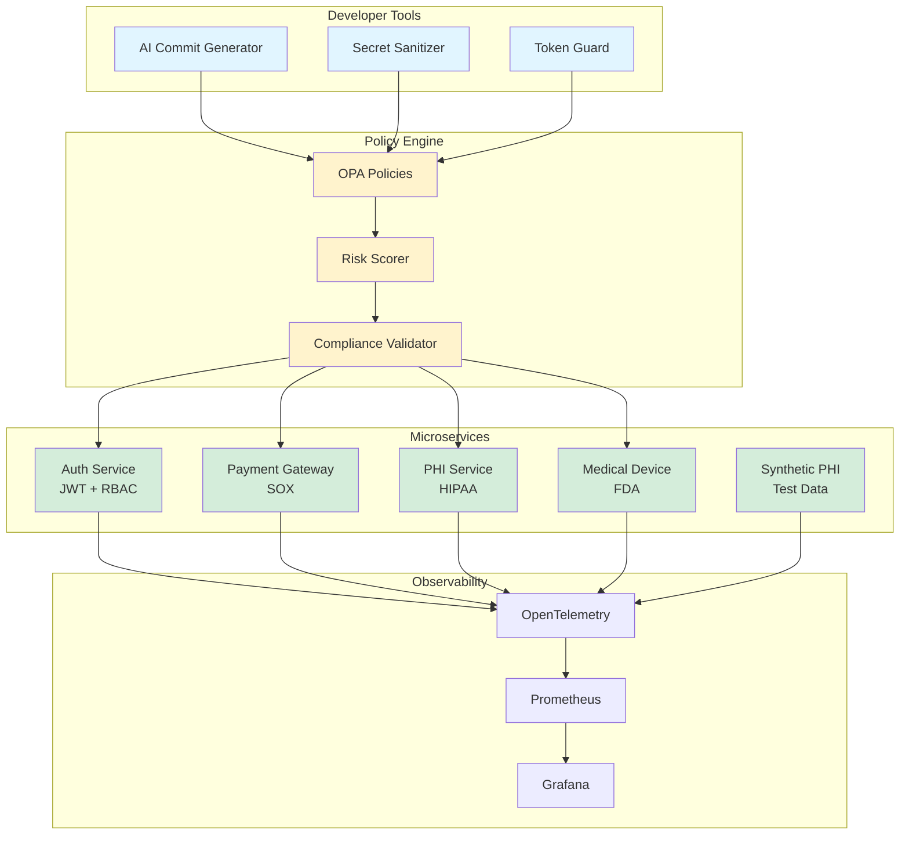

# Documentation

Essential guides for using the Healthcare GitOps Intelligence Platform.

---

## Architecture Overview



---

## Quick Start

```bash
# 5-minute demo
./demo.sh

# See START_HERE.md for detailed walkthrough
```

---

## Essential Docs

All documentation is now consolidated in root directory:

- **[README.md](../README.md)** - Platform overview, quick start
- **[DEPLOYMENT.md](../DEPLOYMENT.md)** - Production deployment (K8s, cloud)
- **[COMPLIANCE.md](../COMPLIANCE.md)** - HIPAA/FDA/SOX reference
- **[CONTRIBUTING.md](../CONTRIBUTING.md)** - Development workflow
- **[START_HERE.md](../START_HERE.md)** - Interactive demo
- **[CODE_REVIEW.md](../CODE_REVIEW.md)** - Engineering standards

---

## By Role

### Developers
1. [README.md](../README.md) - Overview
2. [START_HERE.md](../START_HERE.md) - First demo
3. [tools/README.md](../tools/README.md) - AI tools CLI
4. [CONTRIBUTING.md](../CONTRIBUTING.md) - PR workflow

### DevOps
1. [DEPLOYMENT.md](../DEPLOYMENT.md) - K8s deployment
2. [services/*/README.md](../services/) - Service docs
3. [tests/README.md](../tests/README.md) - Testing

### Compliance
1. [COMPLIANCE.md](../COMPLIANCE.md) - Frameworks
2. [policies/healthcare/README.md](../policies/healthcare/README.md) - OPA policies

---

## Support

- **Issues**: https://github.com/Oluseyi-Kofoworola/gitops2-healthcare-intelligence-git-commit/issues
- **Security**: security@your-org.com

