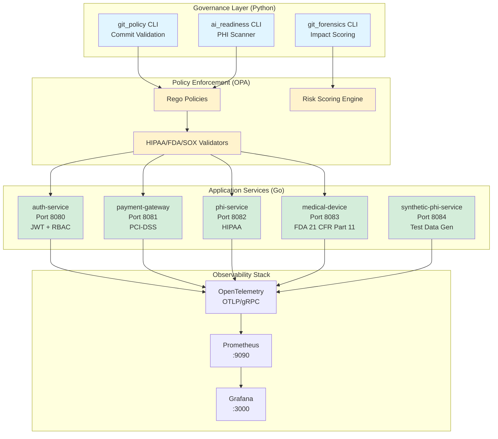

# Technical Documentation

Engineering reference for the Healthcare GitOps Intelligence Platform.

---

## System Architecture



---

## Quick Start

```bash
# Run full demo (includes all 3 flows)
./demo.sh

# Run governance checks manually
python -m src.git_policy.cli --validate-last
python -m src.ai_readiness.cli --format markdown

# Build all Go services
make build-all

# Run unit tests
pytest tests/python/ -v --cov=src
```

---

## Technical Documentation Index

### Core Engineering Docs
- **[START_HERE.md](../START_HERE.md)** - Technical walkthrough, architecture deep-dive
- **[CONTRIBUTING.md](../CONTRIBUTING.md)** - Development workflow, commit standards
- **[DEPLOYMENT.md](../DEPLOYMENT.md)** - Kubernetes manifests, cloud deployment
- **[COMPLIANCE.md](../COMPLIANCE.md)** - HIPAA/FDA/SOX technical controls

### Component-Specific
- **[services/](../services/)** - Go microservices (OpenAPI specs, tests)
- **[src/](../src/)** - Python governance CLIs (git_policy, ai_readiness, git_forensics)
- **[policies/healthcare/](../policies/healthcare/)** - OPA Rego policy definitions
- **[tests/](../tests/)** - Unit, integration, E2E, chaos engineering tests
- **[tools/](../tools/)** - Developer utilities (AI commit gen, secret sanitizer)

### Infrastructure as Code
- **[infra/terraform/github_enterprise/](../infra/terraform/github_enterprise/)** - GitHub repo governance
- **[infra/terraform/azure_observability/](../infra/terraform/azure_observability/)** - Azure Monitor, Log Analytics
- **[observability/](../observability/)** - Prometheus rules, Grafana dashboards

---

## By Engineering Discipline

### Backend Engineers (Go)
1. [services/auth-service/](../services/auth-service/) - JWT middleware, RBAC
2. [services/phi-service/](../services/phi-service/) - AES-256-GCM encryption
3. [services/payment-gateway/](../services/payment-gateway/) - PCI-DSS tokenization
4. [tests/integration/](../tests/integration/) - Service contract tests

### Platform/DevOps Engineers
1. [DEPLOYMENT.md](../DEPLOYMENT.md) - K8s deployments, Helm charts
2. [observability/](../observability/) - Prometheus + Grafana setup
3. [infra/terraform/](../infra/terraform/) - Infrastructure provisioning
4. [tests/chaos/](../tests/chaos/) - Chaos Mesh experiments

### Security Engineers
1. [COMPLIANCE.md](../COMPLIANCE.md) - Security controls matrix
2. [policies/healthcare/](../policies/healthcare/) - OPA policy definitions
3. [src/ai_readiness/](../src/ai_readiness/) - PHI detection scanner
4. [tests/security/](../tests/security/) - OWASP ZAP, penetration tests

### AI/ML Engineers
1. [tools/healthcare_commit_generator.py](../tools/healthcare_commit_generator.py) - GPT-4 integration
2. [.ai/manifest.yml](../.ai/manifest.yml) - AI behavior policies
3. [tools/intelligent_bisect.py](../tools/intelligent_bisect.py) - ML-based regression detection
4. [src/ai_readiness/cli.py](../src/ai_readiness/cli.py) - AI prompt safety checks

---

## API References

### Python CLIs
```bash
# Commit validation (Conventional Commits v1.0.0)
git-policy-validate <commit-msg-file>

# PHI compliance scanner (4 checks: logging, encryption, AI safety, dependencies)
ai-readiness-scan --format [markdown|json] --fail-on [critical|high|medium]

# Git forensics (impact scoring, intelligent bisect)
git-forensics-analyze --range origin/main..HEAD
```

### Go Services (OpenAPI 3.0)
- `auth-service`: http://localhost:8080/swagger
- `payment-gateway`: http://localhost:8081/swagger
- `phi-service`: http://localhost:8082/swagger
- `medical-device`: http://localhost:8083/swagger

### OPA Policy API
```bash
# Test policies locally
opa test policies/ -v

# Evaluate commit against healthcare policies
opa eval -d policies/healthcare -i commit.json "data.healthcare.allow"
```

---

## Monitoring & Debugging

### Logs
```bash
# View service logs (Docker)
docker logs -f auth-service

# View governance CLI logs
tail -f ~/.gitops-health/logs/ai_readiness.log
```

### Metrics
- Prometheus: http://localhost:9090
- Grafana: http://localhost:3000 (admin/admin)

### Traces
- Jaeger UI: http://localhost:16686

---

## Support Channels

- **GitHub Issues**: [Bug reports, feature requests](https://github.com/Oluseyi-Kofoworola/gitops2-healthcare-intelligence-git-commit/issues)
- **Security Disclosures**: security@your-org.com (PGP key in SECURITY.md)
- **Internal Slack**: #gitops-health-eng

