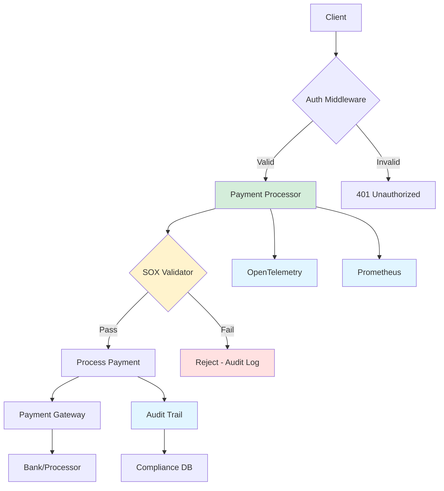

# Payment Gateway Service

Production-grade payment processing with SOX/PCI compliance for healthcare.

---

## Architecture



---

## Overview

Critical financial service handling payment transactions with SOX, PCI-DSS, HIPAA, FDA compliance.

### Key Features

- ✅ **SOX Compliance** - Automated financial controls + audit trails
- ✅ **PCI-DSS Compliant** - Secure payment card processing
- ✅ **HIPAA Integration** - Patient billing with PHI protection
- ✅ **FDA 21 CFR Part 11** - Medical device payment validation
- ✅ **OpenTelemetry Tracing** - Transaction tracing
- ✅ **Prometheus Metrics** - Real-time monitoring
- ✅ **Structured Logging** - JSON logs with correlation IDs
- ✅ **Health Checks** - Kubernetes liveness/readiness probes

## Quick Start

### Run Locally

```bash
# Build the service
go build -o payment-gateway

# Run with default config
./payment-gateway

# Service starts on port 8082
```

### Using Docker

```bash
# Build image
docker build -t payment-gateway:latest .

# Run container
docker run -p 8082:8082 payment-gateway:latest
```

### Deploy to Kubernetes

```bash
kubectl apply -f k8s-deployment.yaml
```

## API Endpoints

### Payment Processing

#### Process Payment
```bash
POST /process
Content-Type: application/json

{
  "amount": 150.00,
  "currency": "USD",
  "payment_method": "card",
  "card_token": "tok_visa_4242",
  "patient_id": "PAT123456",
  "device_id": "DEV789012",
  "metadata": {
    "procedure": "MRI_SCAN",
    "provider": "HOSP_001"
  }
}
```

**Response (Success)**:
```json
{
  "transaction_id": "TXN_20250423_001",
  "status": "approved",
  "amount": 150.00,
  "currency": "USD",
  "processing_time_ms": 45,
  "compliance": {
    "sox_audit_id": "AUD_20250423_001",
    "hipaa_logged": true,
    "fda_validated": true
  }
}
```

#### Charge Payment (Alternative Endpoint)
```bash
POST /charge
Content-Type: application/json

{
  "amount": 150.00,
  "payment_method": "card",
  "card_token": "tok_visa_4242"
}
```

### Health & Monitoring

#### Health Check
```bash
GET /health

# Response
{
  "status": "healthy",
  "service": "payment-gateway",
  "version": "1.0.0",
  "timestamp": "2025-04-23T10:30:00Z"
}
```

#### Prometheus Metrics
```bash
GET /metrics

# Prometheus format output
# payment_transactions_total{status="approved"} 1234
# payment_processing_duration_seconds{quantile="0.95"} 0.045
```

#### Compliance Status
```bash
GET /compliance/status

# Response
{
  "timestamp": "2025-04-23T10:30:00Z",
  "compliance_frameworks": {
    "HIPAA": {
      "status": "compliant",
      "phi_transactions": 5678,
      "audit_trails": 5678
    },
    "SOX": {
      "status": "compliant",
      "financial_controls": "automated",
      "control_testing": "continuous"
    },
    "PCI": {
      "status": "compliant",
      "card_data_encrypted": true
    }
  }
}
```

#### Audit Trail
```bash
GET /audit/trail

# Response
{
  "total_entries": 10000,
  "retention_days": 2555,
  "recent_entries": [...]
}
```

## Compliance Features

### SOX (Sarbanes-Oxley)

- **Automated Controls** - All financial transactions validated
- **Dual Authorization** - High-value transactions require approval
- **Audit Trails** - Immutable logs of all financial activities
- **Financial Reporting** - Real-time compliance reporting
- **Retention** - 7-year audit trail retention

### PCI-DSS

- **Card Data Protection** - No raw card numbers stored
- **Tokenization** - Secure token-based processing
- **Encryption** - AES-256 for data at rest, TLS 1.3 in transit
- **Access Controls** - Role-based access to payment data
- **Security Logging** - All access logged and monitored

### HIPAA

- **PHI Protection** - Patient billing data encrypted
- **Audit Logging** - All PHI access tracked
- **Access Controls** - Minimum necessary principle
- **Data Integrity** - Checksums and validation

### FDA 21 CFR Part 11

- **Device Payment Validation** - Medical device purchase tracking
- **Electronic Records** - Tamper-evident audit trails
- **Electronic Signatures** - Transaction validation
- **Audit Trail** - Complete change history

## Observability

### OpenTelemetry Tracing

All requests are traced with:
- Transaction ID
- Processing duration
- Compliance checks performed
- External service calls
- Error details

**Example trace attributes**:
```
payment.amount: 150.00
payment.currency: USD
patient.id: PAT123456
compliance.sox: true
compliance.hipaa: true
processing.duration_ms: 45
```

### Prometheus Metrics

**Transaction Metrics**:
- `payment_transactions_total` - Total transactions by status
- `payment_processing_duration_seconds` - Processing time histogram
- `payment_amount_total` - Total payment amounts processed
- `payment_compliance_checks_total` - Compliance validations

**Error Metrics**:
- `payment_errors_total` - Errors by type
- `payment_declined_total` - Declined transactions
- `payment_fraud_detected_total` - Fraud detections

**Compliance Metrics**:
- `payment_sox_controls_total` - SOX control executions
- `payment_audit_entries_total` - Audit trail entries
- `payment_phi_transactions_total` - HIPAA transactions

### Structured Logging

All logs in JSON format with:
```json
{
  "timestamp": "2025-04-23T10:30:00Z",
  "level": "info",
  "service": "payment-gateway",
  "transaction_id": "TXN_20250423_001",
  "trace_id": "abc123...",
  "amount": 150.00,
  "status": "approved",
  "processing_ms": 45,
  "compliance": {
    "sox": true,
    "hipaa": true,
    "pci": true
  }
}
```

## Security

### Encryption

- **At Rest**: AES-256-GCM
- **In Transit**: TLS 1.3
- **Key Management**: HashiCorp Vault integration
- **Token Security**: Time-limited payment tokens

### Access Control

- **Authentication**: JWT with short TTL
- **Authorization**: RBAC with least privilege
- **API Keys**: Rotating API keys for service-to-service
- **Rate Limiting**: Per-client rate limits

### Audit

- **All Actions Logged**: 100% audit coverage
- **Immutable Logs**: Write-once audit trail
- **Retention**: 7+ years for SOX compliance
- **Tamper Detection**: Log integrity verification

## Performance

### Benchmarks

```
Processing Speed:     < 50ms p95
Throughput:          1000+ TPS
Concurrent Users:    500+
Error Rate:          < 0.1%
```

### Optimization

- Connection pooling for database
- Caching for frequent lookups
- Async processing for non-critical tasks
- Horizontal scaling with Kubernetes HPA

## Development

### Running Tests

```bash
# Unit tests
go test -v ./...

# With coverage
go test -v -cover ./...

# Integration tests
go test -v -tags=integration ./...

# SOX compliance tests
go test -v ./sox_controls_test.go
```

### Building

```bash
# Development build
go build -o payment-gateway

# Production build (optimized)
CGO_ENABLED=0 GOOS=linux go build -ldflags="-w -s" -o payment-gateway
```

### Environment Variables

| Variable | Default | Description |
|----------|---------|-------------|
| `PORT` | `8082` | Service port |
| `SERVICE_NAME` | `payment-gateway` | Service identifier |
| `MAX_PROCESSING_MILLIS` | `100` | Max processing timeout |
| `OTEL_EXPORTER_OTLP_ENDPOINT` | `http://otel-collector:4317` | OpenTelemetry endpoint |
| `LOG_LEVEL` | `info` | Logging level |
| `SOX_DUAL_APPROVAL_THRESHOLD` | `10000` | Amount requiring dual approval |

## Deployment

### Kubernetes

Deployment includes:
- **3 replicas** minimum for high availability
- **HPA** autoscaling (3-10 pods)
- **PodDisruptionBudget** - min 2 available
- **Resource limits** - CPU: 500m, Memory: 512Mi
- **Health checks** - Liveness and readiness probes
- **Network policies** - Restricted ingress/egress

### Monitoring

**Alerts configured for**:
- High error rate (> 1%)
- Slow processing (p95 > 200ms)
- Compliance violations
- SOX control failures
- High memory/CPU usage

## Troubleshooting

### Common Issues

#### Slow Transaction Processing
```bash
# Check metrics
curl http://localhost:8082/metrics | grep payment_processing_duration

# Check logs
kubectl logs -l app=payment-gateway --tail=100
```

#### Compliance Violations
```bash
# Check compliance status
curl http://localhost:8082/compliance/status

# Review audit trail
curl http://localhost:8082/audit/trail | jq '.recent_entries'
```

#### High Error Rate
```bash
# Check error metrics
curl http://localhost:8082/metrics | grep payment_errors_total

# Get detailed logs
kubectl logs -l app=payment-gateway -f | grep '"level":"error"'
```

## License

Internal use only - GitOps 2.0 Enterprise Platform

## Support

For issues or questions:
- Platform Engineering Team
- Compliance Team (for SOX/PCI questions)
- Security Team (for vulnerability reports)
