# PHI Service

Production-grade Protected Health Information (PHI) encryption and anonymization service with HIPAA compliance.

---

## Architecture


---

## 🎯 Overview

Secure encryption, decryption, hashing, and anonymization for PHI in compliance with HIPAA regulations.

### Key Features

- **AES-256-GCM Encryption**: Industry-standard PHI encryption
- **PBKDF2 Key Derivation**: Secure key derivation (100,000 iterations)
- **SHA-256 Hashing**: Cryptographic hashing for anonymization
- **Salt-Based Anonymization**: Irreversible anonymization
- **OpenTelemetry Tracing**: Full distributed tracing
- **Prometheus Metrics**: Comprehensive observability
- **Structured Logging**: JSON-formatted logs (zerolog)
- **Health Checks**: Kubernetes liveness/readiness probes
- **Graceful Shutdown**: Clean connection draining
- **HIPAA Compliance**: Aligned with HIPAA Security Rule

## 🚀 Quick Start

### Prerequisites

- Go 1.23 or later
- Docker (optional, for containerized deployment)
- Kubernetes cluster (optional, for K8s deployment)

### Local Development

```bash
# Clone the repository
git clone <repository-url>
cd services/phi-service

# Install dependencies
go mod download

# Set environment variables
export ENCRYPTION_KEY="your-32-byte-encryption-key-here"
export OTEL_EXPORTER_OTLP_ENDPOINT="http://localhost:4318"

# Run the service
go run .

# Run with custom port
PORT=8083 go run .
```

### Using Docker

```bash
# Build the image
docker build -t phi-service:latest .

# Run the container
docker run -p 8083:8083 \
  -e ENCRYPTION_KEY="your-32-byte-encryption-key-here" \
  -e OTEL_EXPORTER_OTLP_ENDPOINT="http://otel-collector:4318" \
  phi-service:latest
```

### Kubernetes Deployment

```bash
# Create namespace
kubectl create namespace healthcare

# Deploy the service
kubectl apply -f k8s-deployment.yaml

# Check status
kubectl get pods -n healthcare -l app=phi-service

# View logs
kubectl logs -n healthcare -l app=phi-service --tail=100 -f
```

## 📡 API Endpoints

### Health Checks

#### Health (Liveness)
```bash
GET /health
```

**Response:**
```json
{
  "status": "healthy",
  "service": "phi-service"
}
```

#### Readiness
```bash
GET /readiness
```

**Response:**
```json
{
  "status": "ready",
  "timestamp": "2024-01-15T10:30:00Z"
}
```

### PHI Operations

#### Encrypt PHI Data
```bash
POST /api/v1/encrypt
Content-Type: application/json

{
  "data": "Patient SSN: 123-45-6789"
}
```

**Response:**
```json
{
  "encrypted_data": "base64-encoded-encrypted-data"
}
```

**Example:**
```bash
curl -X POST http://localhost:8083/api/v1/encrypt \
  -H "Content-Type: application/json" \
  -d '{"data":"Patient MRN: 987654321"}'
```

#### Decrypt PHI Data
```bash
POST /api/v1/decrypt
Content-Type: application/json

{
  "encrypted_data": "base64-encoded-encrypted-data"
}
```

**Response:**
```json
{
  "data": "Patient SSN: 123-45-6789"
}
```

**Example:**
```bash
curl -X POST http://localhost:8083/api/v1/decrypt \
  -H "Content-Type: application/json" \
  -d '{"encrypted_data":"<encrypted-string>"}'
```

#### Hash Data
```bash
POST /api/v1/hash
Content-Type: application/json

{
  "data": "patient@example.com",
  "salt": "optional-salt"
}
```

**Response:**
```json
{
  "hash": "sha256-hash-hex-string"
}
```

**Example:**
```bash
curl -X POST http://localhost:8083/api/v1/hash \
  -H "Content-Type: application/json" \
  -d '{"data":"patient@example.com"}'
```

#### Anonymize Data
```bash
POST /api/v1/anonymize
Content-Type: application/json

{
  "data": "john.doe@hospital.com"
}
```

**Response:**
```json
{
  "anonymized_hash": "sha256-hash-hex-string",
  "salt": "base64-encoded-salt"
}
```

**Example:**
```bash
curl -X POST http://localhost:8083/api/v1/anonymize \
  -H "Content-Type: application/json" \
  -d '{"data":"john.doe@hospital.com"}'
```

### Metrics

#### Prometheus Metrics
```bash
GET /metrics
```

**Available Metrics:**
- `phi_service_http_request_duration_seconds` - HTTP request duration histogram
- `phi_service_http_requests_total` - Total HTTP requests counter
- `phi_service_http_active_requests` - Active HTTP requests gauge
- `phi_service_encryption_operations_total` - Encryption operations counter
- `phi_service_encryption_duration_seconds` - Encryption operation duration histogram
- `phi_service_data_size_bytes` - Data size histogram

## ⚙️ Configuration

### Environment Variables

| Variable | Description | Default | Required |
|----------|-------------|---------|----------|
| `PORT` | HTTP server port | `8083` | No |
| `ENCRYPTION_KEY` | 32-byte encryption key | - | **Yes** |
| `OTEL_EXPORTER_OTLP_ENDPOINT` | OpenTelemetry collector endpoint | `http://localhost:4318` | No |
| `LOG_LEVEL` | Logging level (debug, info, warn, error) | `info` | No |

### Security Considerations

1. **Encryption Key Management**
   - Use a 32-byte key for AES-256
   - Store keys in a secure vault (e.g., HashiCorp Vault, AWS Secrets Manager)
   - Rotate keys regularly per HIPAA requirements
   - Never commit keys to version control

2. **Network Security**
   - Use TLS/HTTPS in production
   - Implement network policies in Kubernetes
   - Restrict access using service mesh or ingress rules

3. **Data Handling**
   - Data is encrypted in memory during processing
   - No PHI data is logged
   - Graceful shutdown ensures no data loss

## 📊 Observability

### Distributed Tracing

The service exports traces to OpenTelemetry collectors:

- **Trace Context**: W3C Trace Context propagation
- **Span Attributes**: HTTP method, status code, operation type
- **Service Name**: `phi-service`
- **Instrumentation**: Automatic HTTP and operation tracing

**Example Trace Query (Jaeger):**
```
service.name="phi-service" AND http.method="POST"
```

### Logging

Structured JSON logs with the following fields:

```json
{
  "level": "info",
  "service": "phi-service",
  "method": "POST",
  "path": "/api/v1/encrypt",
  "status": 200,
  "duration_ms": 12,
  "request_id": "abc-123-def",
  "trace_id": "4bf92f3577b34da6a3ce929d0e0e4736",
  "span_id": "00f067aa0ba902b7",
  "timestamp": "2024-01-15T10:30:00Z",
  "message": "HTTP request completed"
}
```

### Metrics Collection

**Prometheus Scrape Configuration:**
```yaml
scrape_configs:
  - job_name: 'phi-service'
    static_configs:
      - targets: ['phi-service:8083']
    metrics_path: '/metrics'
    scrape_interval: 15s
```

**Example Queries:**
```promql
# Request rate
rate(phi_service_http_requests_total[5m])

# 95th percentile latency
histogram_quantile(0.95, phi_service_http_request_duration_seconds_bucket)

# Error rate
rate(phi_service_http_requests_total{status=~"5.."}[5m])

# Encryption operations per second
rate(phi_service_encryption_operations_total[5m])
```

## 🧪 Testing

### Unit Tests

```bash
# Run all tests
go test -v ./...

# Run with coverage
go test -v -cover ./...

# Generate coverage report
go test -coverprofile=coverage.out ./...
go tool cover -html=coverage.out
```

**Coverage Target**: 95%+

### Benchmarks

```bash
# Run benchmarks
go test -bench=. -benchmem

# Benchmark specific operations
go test -bench=BenchmarkEncryption -benchmem
go test -bench=BenchmarkDecryption -benchmem
```

### Integration Tests

```bash
# Start the service
go run .

# Test encrypt endpoint
curl -X POST http://localhost:8083/api/v1/encrypt \
  -H "Content-Type: application/json" \
  -d '{"data":"test data"}'

# Test health check
curl http://localhost:8083/health
```

## 🏗️ Architecture

### Encryption Flow


### Component Diagram

```mermaid
graph TB
    subgraph PHI[PHI Service]
        HTTP[HTTP Server<br/>chi/v5]
        ENC[Encryption Service<br/>AES-256-GCM]
        
        HTTP --> ENC
        
        subgraph MW[Middleware Stack]
            LOG[Logging - zerolog]
            TRACE[Tracing - OpenTelemetry]
            MET[Metrics - Prometheus]
            CORS[CORS]
        end
        
        HTTP --> MW
        
        subgraph OBS[Observability Exports]
            OTLP[Traces → OTLP Collector]
            PROM[Metrics → Prometheus]
            STDOUT[Logs → stdout JSON]
        end
        
        MW --> OBS
    end
    
    style PHI fill:#e1f5ff
    style MW fill:#fff3cd
    style OBS fill:#d4edda
```



## 🔒 Security & Compliance

### HIPAA Compliance

- **Encryption at Rest**: AES-256-GCM encryption
- **Encryption in Transit**: TLS 1.2+ (when configured)
- **Access Controls**: API-level authentication (configure reverse proxy)
- **Audit Logging**: All operations logged with trace IDs
- **Data Minimization**: Only necessary fields processed
- **Secure Disposal**: Memory cleared after processing

### Security Best Practices

1. **Key Management**
   - Use hardware security modules (HSM) for key storage
   - Implement key rotation policies
   - Separate keys for different environments

2. **Network Security**
   - Deploy behind a reverse proxy with TLS
   - Use mutual TLS (mTLS) in service mesh
   - Implement rate limiting

3. **Monitoring**
   - Alert on failed encryption/decryption attempts
   - Monitor for unusual access patterns
   - Track API usage metrics

## 📈 Performance

### Benchmarks

Tested on: MacBook Pro M1, 16GB RAM, Go 1.23

```
BenchmarkEncryption-8        5000    250000 ns/op    2048 B/op    12 allocs/op
BenchmarkDecryption-8        5000    240000 ns/op    1024 B/op    10 allocs/op
BenchmarkHash-8             10000    100000 ns/op     512 B/op     5 allocs/op
```

### Optimization Tips

1. **Horizontal Scaling**: Deploy multiple replicas
2. **Caching**: Cache frequently accessed anonymized hashes
3. **Connection Pooling**: Reuse HTTP connections
4. **Resource Limits**: Set appropriate CPU/memory limits

## 🚧 Troubleshooting

### Common Issues

**Issue**: `Encryption failed`
```
Solution: Ensure ENCRYPTION_KEY is exactly 32 bytes
export ENCRYPTION_KEY="12345678901234567890123456789012"
```

**Issue**: `Cannot connect to OTLP collector`
```
Solution: Verify OpenTelemetry collector endpoint
export OTEL_EXPORTER_OTLP_ENDPOINT="http://otel-collector:4318"
```

**Issue**: `High memory usage`
```
Solution: Check for large payloads. Implement request size limits.
Add to middleware: middleware.Limit(10 * 1024 * 1024) // 10MB
```

### Debug Mode

```bash
# Enable debug logging
export LOG_LEVEL=debug
go run .
```

## 📚 API Documentation

Full OpenAPI specification available at: `openapi.yaml`

**View with Swagger UI:**
```bash
docker run -p 8080:8080 \
  -e SWAGGER_JSON=/docs/openapi.yaml \
  -v $(pwd):/docs \
  swaggerapi/swagger-ui
```

## 🤝 Contributing

1. Follow Conventional Commits format
2. Maintain 95%+ test coverage
3. Update OpenAPI spec for API changes
4. Add metrics for new operations
5. Document all environment variables

## 📄 License

Copyright © 2024. All rights reserved.

## 🔗 Related Services

- **synthetic-phi-service**: Synthetic PHI data generation
- **auth-service**: JWT authentication
- **payment-gateway**: Payment processing with SOX compliance

## 📞 Support

For issues or questions:
- Create an issue in the repository
- Contact the platform team
- Check the troubleshooting section

---

**Built with ❤️ for HIPAA-compliant healthcare applications**
test change
